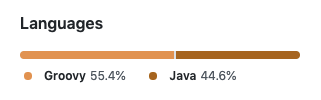

### Prepare before you start
1、在app/下新建文件`local.properties`, 填入如下内容(修改等号后边的值即可):
```xml
# keystore (todo:Please use your keystore file)
keystore_storeFile=../keystore/your keystore
keystore_storePassword=your keystore password
keystore_keyAlias=your keystore alias
keystore_keyPassword=your key password
```

2、将`keystore`文件放入到`project/keystore/`下.

### Groovy
Groovy是一种基于Java平台的面向对象语言。 Groovy 1.0于2007年1月2日发布，其中Groovy 3.0.7(4.0.0-alpha-2)是当前的主要版本。 Groovy通过Apache License v 2.0发布。

Groovy的[官方网站](http://www.groovy-lang.org/)是http://www.groovy-lang.org/

### gradle usage

#### 1、自动修改版本号
[versionName](app/README.md)

#### 2、仓库发布

[publish](lib_publish/README.md)


### 修改默认显示语言
1、在工程目录下新建文件`.gitattributes`  
2、填写指定显示语言，内容如下供参考，注意不能有多余空格。
```
*.gradle linguist-language=groovy
*.java linguist-language=java
```

