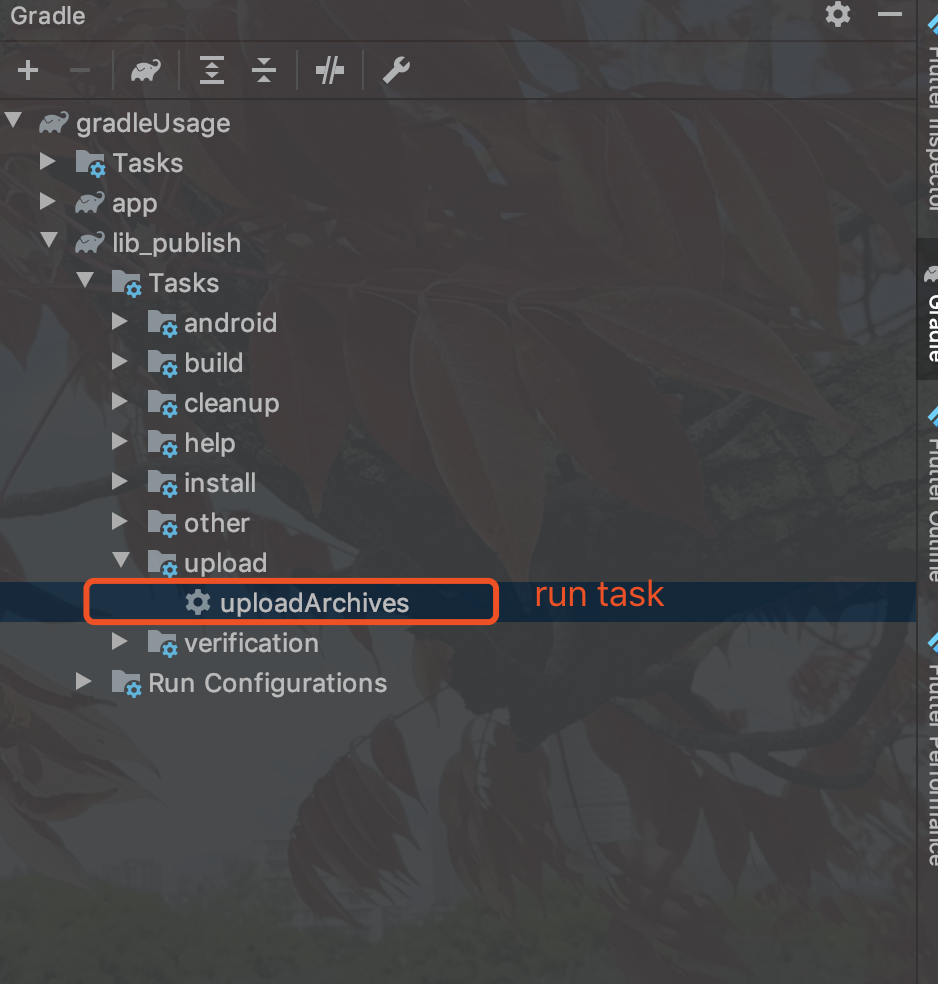

### 1、发布到仓库配置

```xml
apply plugin: 'maven'

ext {
    PUBLISH_GROUP_ID = 'cn.edu.lib'
    PUBLISH_ARTIFACT_ID = 'publish'
    PUBLISH_VERSION = '1.0.2'  // 发布版本号
//    PUBLISH_VERSION = '1.0.1-SNAPSHOT'  // 测试时添加-SNAPSHOT
}

android { ... }

// 是否发到本地maven(测试用)
def publishLocal = false

// 正式包地址
def releaseRepositoryUrl = "TODO:Fill in the repository link"
// SNAPSHOT仓库地址
def snapShotRepositoryUrl = publishLocal ? repositories.mavenLocal().getUrl() : "TODO:Fill in the repository link"

uploadArchives {
    repositories.mavenDeployer {

        // 正式仓库地址
        repository(url: releaseRepositoryUrl) {
            // 用户校验
            authentication(userName: '用户名', password: '密码')
        }
        // 快照仓库地址（可选）
        snapshotRepository(url: snapShotRepositoryUrl) {
            // 用户校验
            authentication(userName: '用户名', password: '密码')
        }

        pom.project {
            groupId project.PUBLISH_GROUP_ID
            artifactId project.PUBLISH_ARTIFACT_ID
            version project.PUBLISH_VERSION
            packaging 'aar'
        }
        // 去除pom文件引用依赖
        pom.whenConfigured { pom ->
            pom.dependencies.clear()
        }
    }
}
```

### 2、sync project with gradle files

### 3、run uploadArchives task


### 4、add dependencies
```xml
	implementation 'cn.edu.lib:publish:1.0.2'
```

### 5、invoke
```android
	TestLib.getMessage(1);
```
